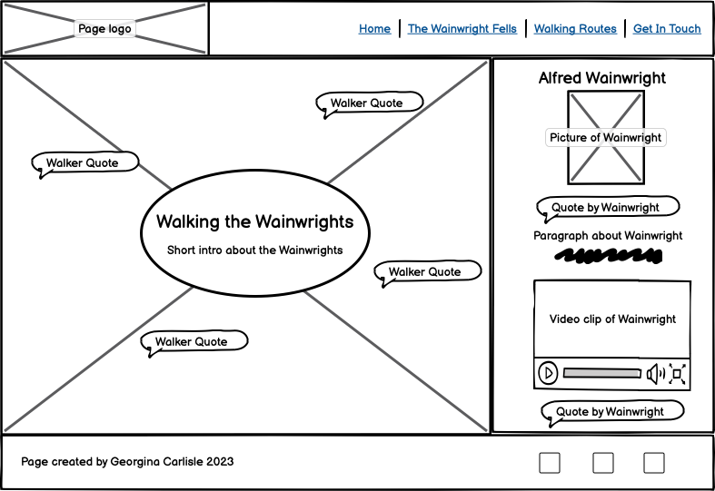
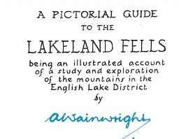
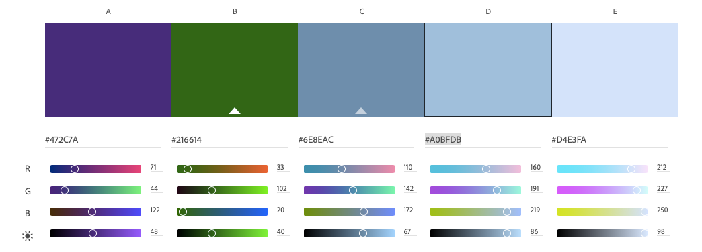
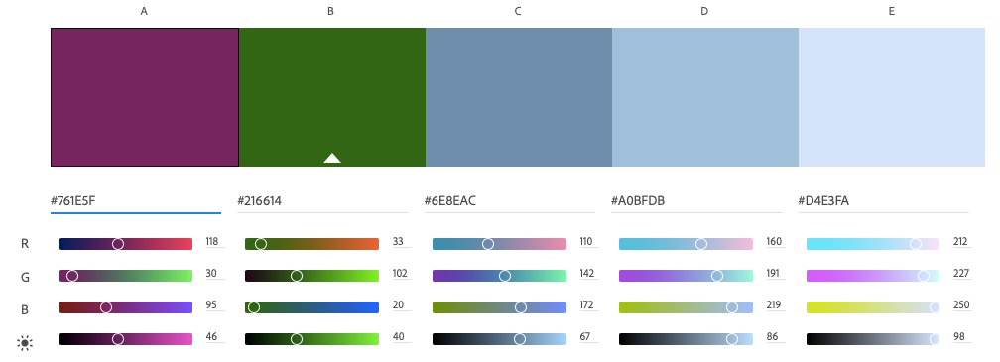

# Walking the Wainwrights 
(Developer: Georgina Carlisle)

Responsive site images

Project description

Link to live page

## Contents
[Features](#features)

[Design](#design)
- [The Strategy Plane](#the-strategy-plane)
- [The Scope Plane](#the-scope-plane)
- [The Structure Plane](#the-structure-plane)
- [The Skeleton Plane](#the-skeleton-plane)
- [The Surface Plane](#the-surface-plane)

[Development](#development)

[Testing and Validation](#testing-and-validation)

[Bugs and fixes](#bugs-and-fixes)

[Deployment](#deployment)

[Languages](#languages)

[Tools and Technologies](#tools-and-technologies)

[Credits](#credits)

[Acknowledgements](#acknowledgements)

***

## Features

### Header

### Footer

### Page Introduction

### Alfred Wainwright

### The Wainwright Fells

### Looking after the Fells

### Walking Routes

### Walking tips

### Get in touch

### 404

### Features to be implemented

[Return to contents list](#contents)

## Design

### The Strategy Plane

#### Users
The primary target user group enjoy fell walking in the Lake District National Park and are specifically looking to summit some/all of 'The Wainwrights'. There is a secondary target user group who enjoy fell walking in the Lake District National Park and are looking at find out more about, and begin summiting 'The Wainwrigths'.

Value for the user (in order of importance)will be provided through:
- Walking routes that incorporate the Wainwrights
- Specific information about the Wainwright fells
- Information on looking after the fells
- Information about the geography, geology and history of the fells
- Tips and stories from other fell walkers
- Information about Alfred Wainwright
- Walking advice

Further information about user research and adaptation to initial target user group.

<!-- I used the following to learn how to create a dropdown: https://dev.to/asyraf/how-to-add-dropdown-in-markdown-o78  -->

##### Initial target Users

The primary target users are fairly new to fell walking in the Lake District. They may have heard the name ‘Wainwright’ and the concept of ‘The Wainwrights’ and want to learn more.

The secondary target users fall to either side of the above being either:
-	Completely new to walking in the Lake District and looking to head out on their first fell walk.
-	Keen fell walkers who are looking to specifically climb the Wainwright fells.

##### User Stories

USER A (primary target user)

Background: User A has visited the Lake District before or is a resident. They have done a little fell walking in the Lake District, probably one or two of the more well-known walks, have really enjoyed it and would like to do more. User A has not heard the name ‘Wainwright’.

Action: They search online to find out more about the Lake District fells and about fell walking in general. Possible key words/phrases they may search include: Lake District walks/mountains/fells, fell walking, mountain walking.

Required value:
1. Information about walking routes and fells to summit in the Lake District.
2. Detailed advice on fell walking (being prepared, staying safe and enjoying the walk)
3. Tips and stories from other people who enjoy walking in the Lake District.
4. Links to access more detailed information (other sites, maps, books)
5. They may also be interested in the geography, geology and history of the fells.

USER B (primary target user)

Background: User B like User A has done a little fell walking and is interested in doing more. User B though has heard the name ‘Wainwright’ and the concept of ‘The Wainwrights’
and would like to find out more.

Action: They search online to find out more about Wainwright (action and value described below) and fell walking in the Lake District (action and value is the same as user A and is described above). Possible key words/phrases they may search: Wainwright, Arthur Wainwright, the Wainwright fells/mountains/walks, the Wainwrights.

Required value:
1. Information about Arthur Wainwright. In particular: who he was and how he is linked to the fells of the Lake District.
2. Information about ‘The Wainwrights’. In particular: which fells are part of the Wainwrights and further information as to location, height and walking routes.
3. They may also be interested in the history of Wainwright’s life, the books he wrote and any further details.

USER C (secondary target user)

Background: User C is about to visit the Lake District (holiday/day trip) and is thinking about including fell walking as one of their holiday activities. 

Action: They follow links from sites they are already using to research their holiday or complete a Google search with the possible key words/phrases: walks/walking/fell walking in the Lake District, climbing Lake District mountains/fells, Lake District walks/mountains/fells.

Required value: 
1. Potential walks, including positive features, pictures from the walk, what to expect (what will they see, how hard, how far, how high, terrain), map/clear instructions and how to get to the start of the walk.
2. Advice, such as: what to pack, tips for an enjoyable walk and how to stay safe.
3. Walk reviews and tips from real people.

USER D (secondary target user)

Background: User D knows about Arthur Wainwright and ‘The Wainwrights’ and has decided they want to follow in his footsteps and complete some if not all the Wainwright fells.

Action: They search online with key words/phrases such as: Wainwright, Arthur Wainwright, the Wainwright fells, the Wainwrights.

Required value:
1. Specific Information about completing ‘The Wainwrights’. Including detailed information on all the Wainwright Fells.
2. Tips, advice and links to anything that might help them on their quest. This might include: detailed advice on fell walking (being prepared, staying safe and enjoying the walk), links to purchase Wainwright’s books and reviews on walking equipment.
3. Stories from or links into a community of walkers, like them, who are completing ‘The Wainwrights’.

##### User Research

I created the following Google form which I then asked people who fell into both my primary and secondary target groups to complete.

I received 9 responses to my survey covering the following target user groups:
- 1 x I have not been fell walking in the Lake District, but it is something I would be keen to try 
- 0 x I have done some fell walking in the Lake District and would like to do more. I have not heard the name ‘Wainwright’.
- 3 x I have done some fell walking in the Lake District and would like to do more. I have heard the name ‘Wainwright’ and the concept of 'The Wainwrights' and would like to learn more. 
- 5 x I know who Arthur Wainwright is and I am specifically looking to summit some/all of ‘The Wainwrights’. 

Findings:

When looking in more detail at the different reponses when grouped by user target groups I found:
- Those users who are specifically looking to summit some/all of 'The Wainwrights' had more required value within the scope of this survey (they all ticked more of the given options).
- A correlation between user groups and a desire to find out more about the 'Wainwright fells'. New to fell walking - no interest, Enjoy fell-walking and have heard of Wainwright - some interest Specifically looking to summit Wainwrights - High interest

The required values ticked by those specifically looking to summit Wainwrights:
-	4 x Walking routes (specifically walks that incorporate the Wainwrights)
-	3 x Information about ‘The Wainwright fells’ 
-	3 x Details specific to summiting the Wainwrights fells incl. tips and advice.
-	3 x Information on looking after the fells. Including reducing pollution, disturbance of flora and fauna and erosion of the landscape.
-	3 x Information about the geography, geology and history of the fells.
-	2 x Tips and stories from other fell walkers.
-	Information about Alfred Wainwright, who he was and his links to the Lake District fells.
-	More about the Lake District National Park and it’s fells.
-	Walking advice, such as what to wear, what to take, how to stay safe and tips for enjoying your walk to the full.

Conclusion:
This project will gel together much better as a whole if I change and narrow the primary target user group to just those specifically looking to summit Wainwrights. I will consider a secondary target user group of those who enjoy fell walking in the Lake District and might be looking to find out more about the Wainwright fells when designing the site but they will not be the main focus.
The results of this survey will be further used to inform the scope plane of development.

#### Owner

Value for the owner of this website will be provided in:
1. Sharing their love for the Lake District Fells and in particular summiting the Wainwright fells.
2. Informing others how best to keep themsleves safe and look after the fells while out walking.
3. Providing support to others looking to summit the Wainwrights.

Further information on purpose of this website for the owner.

This website is being created for my portfolio project one, as part of my Diploma in Full Stack Software Development. 
The purpose of the project is to:
-	‘Design an interactive Front-End web application using HTML and CSS based on the principles of user experience design, accessibility and responsivity.’
-	‘Test a Front-End web application through the development, implementation and deployment stages.’
-	‘Deploy a Front-End web application to a Cloud platform’.
-	‘Maximise future maintainability through documentation, code structure and organisation’.
-	‘Demonstrate and document the development process through a version control system such as GitHub’.

(Note: The above quotes have been taken directly from the ‘Portfolio 1 Assessment Guide’ written by Code Institute)

The value to both myself (Georgina Carlisle) is:
-	 Fulfilment of the above criteria demonstrating characteristics of high-level performance.

#### Competitors
Position of site amongst competition:
- The proposed website would be unique as there are no current websites that bring together everything the target user group is looking for.
- With a high-level positive user experience this website would stand out from other websites which offer some of the same value.
- Prominently placing information about looking after the fells within this site
would be a big step in helping more fell walkers to become better aware of how to lessen their impact while out walking.

Further information about competitor research.

#### Competitor Reviews

I undertook an online search using the key words from the user stories. For each relevant site found I then asked the following questions:
1. What required value might my primary and secondary users gain from the site?
2. What sort of user experience does the site provide?

Relevant websites looked at:

https://www.lakedistrict.gov.uk
https://www.walklakes.co.uk
https://www.visitlakedistrict.com
https://www.lakedistricts.co.uk
https://www.thelakedistrict.org/
https://fellwalks.uk
https://www.wainwright.org.uk
https://www.walkingenglishman.com
http://www.wainwrightroutes.co.uk
https://www.wainwrightwalking.co.uk/

Key findings:
- The websites that included information on the Lake District, walking routes, fell walking advice and information about looking after the fells had very little information about Alfred Wainwright and the Wainwright Fells.
- The websites that provided information on Wainwright and the Wainwright fells didn’t give fell walking advice, information about looking after the fells or any general information about the Lake District. 
- Of the websites that did provide some information on Wainwright, some only gave lists or a map to show the Wainwright fells and no further information, some were more of a hobby/blog style site, and some didn’t load very well. ‘The Wainwright Society’ (wainwright.org.uk) was more about joining together as a community and community events and fundraising and didn’t provide any real information for someone new to walking the Wainwrights.
- During my research I found numerous websites that included a large variety of walking routes with a high level of detail provided.
- My experience as a user trying to gain all the required value from the user stories was not particularly positive. The main negatives were ease of navigation to find what I was looking for (due predominantly to size of site, but also missing navigation links with a need to scroll to find information) and the amount and detail of information presented. I found some of the websites overwhelming and off putting. I did however come across some designs that drew me in well as a user and one website that had great presentation, layout and organisation and made me feel instantly more at home to search through the site.

Conclusion:
1. A website that combines information about Wainwright and the Wainwright fells, with walking advice and information about looking after the fells, would have something unique to offer.
2. A website providing a high-level positive user experience, in order to quickly locate information about the Lake District fells plus advice on fell walking and walking routes, and/or information about Wainwright and the Wainwright fells, would stand out for the crowd.
3. While a number of sites do provide information on looking after the fells, this isn’t prominently placed and the information may therefore not be reaching users. The exception being https://www.lakedistrict.gov.uk/.
4. Details about walking routes in the Lake District are currently offered on numerous websites.

[Return to contents list](#contents)

### The Scope Plane

The scope for this project builds on the strategy plane and is heavily influenced by the results of my research (see [Competitor Reviews](#competitor-reviews) and [User Research](#user-research)). Time has been taken to fully explore the requirements of both user and owner, and how these could be met. 
Following an agile approach, the first sprint of this project will aim to keep time and other resources to a minimum whilst ensuring the project is vaible, providing enough value and an excellent user experience that will leave early users keen to return.

| Requirement | Ideas to meet requirement | Inclusion |
| --- | --- | --- |
| Sharing a love of the Wainwright fells.  | 1. Use of positive and emotive language throughout the site. | Now |
| | 2. Spectacular images that showcase the variety of landscapes to be found among the Wainwright fells. | Now (a few key images at this stage - add to later on) |
| | 3. Quotes from fell walkers sharing what they love about walking the wainwrights | Now (A few that give a big impact) |
| Inspire users to get out fell walking | See share a love (1, 2 + 3) and planning next walk (4, 7, 12) | |
| Provide ideas for users next walk| 4.  Clear walking routes including: | Now (limitited number, 3 to begin, add more later) |
| | 5. map of the route | Now (limited function, improve later on) |
| | 6. start and end point (if different) | Now (basic info, improve later on) |
| | 7. images of fell/views/points of interest | Now (2-3 images, more added later) |
| | 8. Key things to note about route | Now |
| | 9. Walk stats (elevation height, distance) | Now |
| | 10. Clear directions | Later |
| | 11. Images showing route | Later |
| | 12. Fell walking story of route | To be decided (if now keep short and ensure adds value) |
| Provide details on the Wainwright fells | 13. Full map of the lakes, showing all Wainwright fells | Now (limited function, improve later) | 
| | 14. Individual fell information | Now (list of all 214 fells, plus height and location area, link to routes if available, later add a very short description to each) |
| Provide knowledge that will lessen the users impact on the fells (flora, fauna and landscape) | 15. Information about looking after the fells plus images | Now |
| | 16. Links to other websites/charities who are concerned with looking after the fells | Now |
| A sense of community | 3 + 12 |
| | 17. A form to allow new users to send their fell walking stories, images and tips which would be fed into further site development| Now |
| | 18. Top tips from other fell walkers | Later |
| Provide knowledge that will help users to stay safe while fell walking | 19. Top tips plus images| Now |
| | 20. Link to mountain rescue website | Now |
| | 21. Fell top Weather app | Now |
| Further information to help the user enjoy and appreciate the fells further | 7 + 8 | |
| | 22. Information on geology, geography and history of the fells | Later |
| Provide insight into who Wainwright was | 21. Information about Wainwright. | Now (keep short and simple to begin with, add to later) |
| | 23. Image of Wainwright | Now (single image, add to later) |
| | 25. Video clip of Wainwright | Now (single video, add to later) |
| | 26. Quotes from Wainwright | Now |
| | 27. Images of and links to Wainwrights books | Now |
| | 28. Pictures that Wainwright drew in his books | Later |

[Return to contents list](#contents)

### The Structure Plane

The website will consist of three main pages – Home, The Wainwright Fells and Walking Routes. Each of these will have a main section and an aside.
There will also be a fourth page - Get in touch, this will only have one section.

#### Information Architecture

Home 
-	Introduction to site
    *	Spectacular image/s 
    *   Main title
    *	Short intro
    *	Quotes from walkers and from Wainwright
    *	Key words to indicate what can be found on the site
-	Alfred Wainwright (as an aside on this page, users less likely to choose to navigate to this info but it is integral to the whole concept of ‘The Wainwrights’)
    *	Image of Wainwright
    *	Brief description
    *	Quote
    *	Video clip
    *	Images of and links to his books 

Wainwright's Fells
-	The Wainwright Fells
    *	Map showing all the Wainwright fells
    *	List of all 214 fells (name, height, location, 1 sentence)
-	Looking after the fells (as an aside on this page, users less likely to choose to navigate to this info but important that they see)
    *	Quick explanation of importance
    *	How you can help
    *	Links to charities/websites working to look after the fells

Walking Routes
-	3 x walking routes (structure to place elements that will help the user decide for/against the walk at the top)
    *	Route name and summits included
    *	3x images of fell/views/points of interest
    *	Walk stats and key things to note
    *	Fell walking story
    *	Map of the route
    *	Start and end points
-	Walking tips (as an aside on this page, users less likely to choose to navigate to this info but important that they see)
    *	Safety tips
    *	Enjoyment tips
    *	Link to or in page placement of a fell top weather app
    *	Link to Mountain Rescue

Get in touch
- Contact form
    * Spectacular image of fells incl. walkers
    * Introduction - reason for form and how data gathered will be used
    * Form

Note: Further structure will need to be added as the number of walking routes increases

#### Navigation

Primary navigation will be through the header (incl. logo linked to home) and nav (links to each page).

Some secondary navigation will also exist:
-	Key words on home page will link through to relevant sections.
-	Fell names on ‘The Fells’ page will link to the walk including them, should one exist. 

To support navigation:
-	The header will have an absolute position and always be visible.
-	The nav link for the page currently in will be visibly different to other links.
-	Links and interaction points clearly visible through consistent styling incl. using the hover pseudo selector.
-	Content will be hinted at where it continues outside of view through layout choices.

To support accessibility:
- Use of semantic html
- Secondary navigation to be clearly identifiable (both semantically and visibly)
- Clear headings throughout to support semantics and allow for navigation around the page.
- Clear groupings of information

[Return to contents list](#contents)

### The Skeleton Plane

The following wire frames show the intended design of each of the four pages when viewed on a desktop computer and on a smart phone.

#### Home page

Notes on the 'home' page: 
- Images of and links to Wainwright's books will now appear on 'The Wainwright Fells' page.
- Main image may be a single image or a number of images.
- Header may have a plain background or be a panoramic view showing the ridge line of some of the fells.
- Key words, as per the structure plane, have not been included here.

#### The Wainwright Fells page

Notes on 'The Wainwright Fells' page:
- Images of and links to Wainwright's books will appear under the corresponding list of fells.
- Content will be hinted at, where it extends below the bottom edge of the screen.
- Font awesome icons will be used next to each tip to convey meaning.

#### Walking Routes page

Notes on the 'Walking Routes' page:
- Weatherline will either be a link or an iframe.
- Content will be hinted at, where it extends below the bottom edge of the screen. There will be three walking routes each tagged as an article.

#### Get In Touch page

Notes on the 'Get In Touch' page:
- Exact placement of the form, when viewed on a desktop computer, will be determined by the background image.

[Return to contents list](#contents)

### The Surface Plane

#### Typography

Three font styles are used throughout the site in order to make both the headings and the quotes stand out visually as different from the main body of text. 

For the headings I wanted to draw some parallels with how Wainwright chose to style the headings within his guide books, all of which were handwritten. I therefore chose the serif font **Roboto Slab**.

For the remaining text I wanted a font that would be easily readable (sans-serif) and still work alongside Roboto Slab. I therefore chose the sans-serif font **Montserrat**.

For the Wainwright quotes I have included, I again wanted to draw parallels with how Wainwright chose to style the main body of text within his guidebooks. While the books were handwritten, Wainwright took great care to make his handwriting neat and legible. I therefore chose the cursive font **Klee One**.

#### Colour Scheme

Inspiration for the background colours (C-Header, D-Aside, E-Main) came from the lakes, tarns, rivers and streams of The Lake District.

The colour (B) for all headings across the site links to the forests, woods, ferns and bracken of The Lake District.

Finally, all anchor links across the site take on the colour (A) of heather in flower. In the image below you can see how anchor links will change colour when active or on hover.

[Return to contents list](#contents)

## Development

The finished website deviats from the original design in a number of ways:

1 -

[Return to contents list](#contents)

## Testing and Validation

### HTML Validation

All html files have been checked and validated using the [NU Html checker](https://validator.w3.org/nu/) and all now return a 'No errors or warnings to show' message. 

#### HTML errors on first testing

The following errors came up on initial testing:
- Stray start tags on all caption elements. I looked again at the figure element researching correct use: https://www.w3schools.com/tags/tag_figure.asp. I then replaced caption with figcaption in all instances.
- Stray end tags on all caption elements. As above.
- Bad values for width and height attributes on all iframe elements. Width and height attributes moved into style.css.
- Frameborder attribute on all iframe elements is obsolete. Attribute removed with no ill effects.
- Stray end tag for h2 (line 46 - walking-routes). Left in error and now removed.
- Element ul not allowed as a child of a span (line 449 - walking routes). I re-looked at the code I had used to create the un-ordered lists in both walking-routes.html and wainwright-fells.html and replaced the span elements with the more appropriate p element throughout.

### CSS Validation

The file style.css has been checked using [The W3C CSS Validation Service](https://jigsaw.w3.org/css-validator/) and validates as CSS level 3 + SVG.

### Accessibility and performance

### Contrast

The [WebAIM contrast checker](https://webaim.org/resources/contrastchecker/) has been used to ensure text is easy to read. 

All text within the main sections passes as WCAG AAA. All text within the aside sections passes as WCAG AAA with the exception of the hover link text which passes at WCAG AA.
Within the header all text passes at WCAG AA and above where the text is larger.
Within the footer all text passes at WCAG AAA.

Contrast scores relating to the main sections of the website

Contrast scores relating to the aside sections of the website

Contrast scores relating to header and footer

Note: Some adjustment of initial colour scheme was made in order to achieve better contrast.

### Links (internal and external), media and forms

All internal links have been tested. These take you to the specified location within the site.

All external links have been tested and open in a new tab.

The two videos have been tested and work to view in situ, full screen or on YouTube (this opens in a seperate tab).

The 'Get in Touch' form has been tested. Submission is prevented when the name and email have not been filled in and prompts appear to the user. On clicking submit the user is taken to a thank you page. The form functions have also been separately tested using ......

Insert screenshot 

### Further testing

This website has been tested on the following browsers and responds without issue:
- Google Chrome
- Safari

This website has also been tested on the following smart phones:
- iPhone 12 mini

Numerous friends and family also tested the website, providing feedback on user experience.

[Return to contents list](#contents)

## Bugs and fixes

| Bug | Fix |
| -- | -- |
| Hover zoom function for the maps doesn't respond well on smart phones | |
| Textarea boxes in the get in touch form appear to be partially filled | |
| Logo link to the Mountain rescue is not centralising when the aside jumps to a full screen width | |
| Having adjusted the list code to meet html validation the extra bullet points within the mobile phone list element now sit alongside instead of below | |

[Return to contents list](#contents)

## Deployment

[Return to contents list](#contents)

## Languages

- HTML
- CSS
- Markdown

[Return to contents list](#contents)

## Tools and Technologies

- Git
- GitHub
- VScode with extensions: Markdown Preview GitHub Styling, Live Server, Dev Containers, GitHub Pull Requests and Issues
- Google forms
- [Balsamiq wireframes](https://balsamiq.com/)
- [Adobe Color](https://color.adobe.com/create/color-wheel)
- [WebAIM contrast checker](https://webaim.org/resources/contrastchecker/)

[Return to contents list](#contents)

## Credits

Where I have followed advice or have learnt something new, this has been acknowledged in the  [Acknowledgements](#acknowledgements) section.

The following is a list of specific credit for images, content and code not created by myself. A comment has also been added into the code in these instances.

- **Template** used to create this repository by Code Institute ([ci-full-template](https://github.com/Code-Institute-Org/ci-full-template)).

- **Font**: Roboto Slab by Christian Robertson - [Google Fonts](https://fonts.google.com/specimen/Roboto+Slab#styles).
- **Font**: Montserrat by Julieta Ulanovsky, Sol Matas, Juan Pablo del Peral and Jacques Le Bailly - [Google Fonts](https://fonts.google.com/specimen/Montserrat?query=Mont).
- **Font**: Klee One by Fontworks Inc. - [Google Fonts](https://fonts.google.com/specimen/Klee+One?query=Klee+One).

- **Icons** used throughout the site are from [Font Awesome](https://fontawesome.com/).

- **Image**: map-wainwright-fells.jpg by [Guide Us](https://guideus.co.uk/map-shop/wainwright-fells-map).
- **Images**: route-map-gowbarrow, route-map-castlerigg and route-map-coledale-horseshoe along with length, ascent and average time. Credit to [Ordnance Survey](https://www.ordnancesurvey.co.uk/) for the map and the software used to create the route.
- **Images**: photo-aira-beck.jpg, photo-aira-force.jpg, photo-bleaberryfell.jpg, photo-castlerigg-stone-circle.jpg, photo-path-through-heather.jpg, photo-loweswater.jpg, photo-tarn-at-leaves.jpg and photo-view-from-greatgable-.jpg are used with the permission of [KeswickLimey Photography & Framing](https://www.keswicklimey.co.uk/) and all photos are also credited with a link to website within the figure caption.
- **Images**: all book images from [Waterstones](https://www.waterstones.com/). A link to Waterstones has also been set up for each book image.
- **Image**: photo-prepared-walkers was a free download from [Guduru Ajay bhargav](https://www.pexels.com/@ajaybhargavguduru/). This photo is also credited, within the caption, with a link to the author's pexel page.
- **Image**: logo-countrysidecode was taken from [gov.uk/countryside-code](https://assets.publishing.service.gov.uk/government/uploads/system/uploads/attachment_data/file/1052574/Countryside_Code_A5.pdf). The logo is used as a link to a pdf of 'The Countryside Code A5 Leaflet'.
- **Image**: logo-fixthefells taken from [Fix the fells](https://www.fixthefells.co.uk/). The logo is used as a link to the fix the fells website.
- **Images** colour-scheme.png and colour-scheme-hover.png created using [Adobe Color](https://color.adobe.com/create/color-wheel).

- **YouTube video**: tips-video was created by The Lake District National Park - [link to video](https://www.youtube.com/watch?v=NlfuNgqzz3M).
- **YouTube video**: wainwright-video was cereated by BBC4 and posted to YouTube by Garry Pickles - [Link to video](https://www.youtube.com/watch?v=QbzIZuyGa0s&t=1s).

- **Text**: The first three paragraphs in the information about Wainwright are taken from the article [Why does Alfred Wainwright still loom large over the Lake District?](https://www.bbc.co.uk/news/uk-england-cumbria-57528980) written by Simon Armstrong (BBC News) and first published 5 September 2021.
- **Text**: Names and heights of the Wainwright fells copied from [GuideUs](https://guideus.co.uk/list-of-wainwright-fells).
- **Text**: Wording for the introduction paragraph to the walking tips copied from the [lakedistrict.gov.uk](https://www.lakedistrict.gov.uk/visiting/things-to-do/walking/walking-safety-tips) website.
- **Text**: Sections of the text within the list of walking tips (all clearly marked within the code) was copied from the [lakedistrict.gov.uk](https://www.lakedistrict.gov.uk/visiting/things-to-do/walking/walking-safety-tips) website.
- **Text**: Sections of the text within the list of walking tips (all clearly marked within the code) was copied from [The Lake District Search & Mountain Rescue Association](https://ldsamra.org.uk/advice.php) website.
- **Text**: Wording for the introduction text in the 'Looking after the fells' aside copied from the [LakeDistrict.gov](https://www.lakedistrict.gov.uk/) website.
- **Text** Sections of the text within the 'Looking after the fells' aside copied from the [LakeDistrict.gov](https://www.lakedistrict.gov.uk/visiting/countryside-code) website.

- **Coding idea** for the styling of container-form and some of the code was taken from [Code Institute's](https://codeinstitute.net) 'Love Running' walkthrough.
- **Coding idea**: map-container:hover styling. I referred to the following article when creating this styling: How to zoom an image on mouse hover using CSS by [Geeks for Geeks](https://www.geeksforgeeks.org/how-to-zoom-an-image-on-mouse-hover-using-css/amp/).
- **Coding idea**: embedded Youtube videos. I copied embed video code from YouTube (editing slightly) and also followed the tutorial: HTML & CSS - How to Embed a YouTube Video in Your Website [Youtube - Wed dev tutorials](https://www.youtube.com/watch?v=ly36kn0ug4k).

[Return to contents list](#contents)

## Acknowledgements

My husband - There throughout the building of this project and always able to spare a few minutes to look at every new section of the site as it came into being.

My two young boys - For their support throughout and complimentary words.

My Dad (KeswickLimey Photograpy & Framing) - The inspiration for my love of fell walking in the Lake District. You have joined me on many a walk and your spectacular photographs are a window for all to experience the beauty of the Lake District.

Friends and family - Who filled in my target user survey and checked out my site giving me valuable feedback.

[Code Institute](https://codeinstitute.net) - The majority of the coding skills, knowledge and understanding showcased in this project have been learnt through the 'Diploma of Full stack software development' that I am completing with Code Institute.

My Mentor Gurjot - For patiently listening to all my questions and giving me some much appreciated pointers in the right direction.

My fellow Code Institute peers - I have picked up numerous tips from other students within the course slack channel.

### Websites, articles and tutorials

[W3 Schools](https://www.w3schools.com/) - I used this site throughout the creation of this project to check my understanding of html elements and css properties and learn about their associated values.

[mdn web docs](https://developer.mozilla.org/) - I used this site throughout the creation of this project to check my understanding of html elements and css properties and learn about their associated values.

[Markdown Guide](https://www.markdownguide.org) - The majority of Markdown syntax used in this README was picked up from this site.

[GitHub Docs: Basic writing and formatting syntax document](https://docs.github.com/en/get-started/writing-on-github/getting-started-with-writing-and-formatting-on-github/basic-writing-and-formatting-syntax) - How to use the Markdown language was also picked up from this document.

[Article:How to add Dropdown in Markdown ?? by Amirul Asyraf](https://dev.to/asyraf/how-to-add-dropdown-in-markdown-o78) - I used this article to learn how to create a dropdown in my README.

[Webinar: The world is your user agent: why semantic HTML is important for accessibility](https://www.deque.com/axe-con/sessions/the-world-is-your-user-agent-why-semantic-html-is-important-for-accessibility/) - I found this incredibly helpful in understanding what semantic html is and how to use it correctly to make my website accessible.

[HTML living standard - 28 April 2023](https://html.spec.whatwg.org) - I found this document useful in further learning about semantic html.

[W3C tutorials](https://www.w3.org/WAI/tutorials/) - I found this useful in learning further about creating an accessible website.

[Typo-io](https://typ.io/fonts/roboto_slab) - I used this website in order to find a font for the main body of my text that would work alongside Roboto Slab.

[CSS-Tricks: A complete guide to Flexbox](https://css-tricks.com/snippets/css/a-guide-to-flexbox/) - I found this article useful in learning more about flexbox layout, which I have then used in the aside section about Wainwright in index.html.

[Return to contents list](#contents)